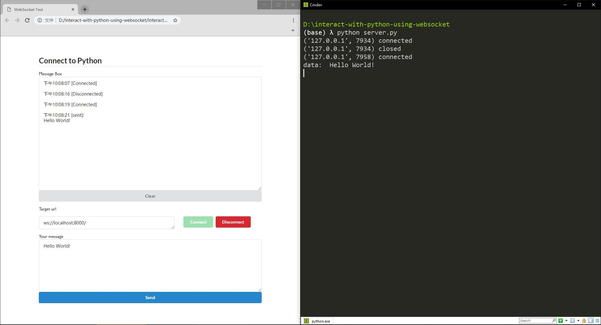

# interact with python using websocket



A super simple project to exchange message between a webpage and a python script using websocket from [simple-websocket-server](https://github.com/dpallot/simple-websocket-server).

## STEP1: run server
```
python server.py
```

## STEP2: open html
Open interact.html in browser or use SimpleHTTPServer to host it.
Open multiple times in browser to share messages.